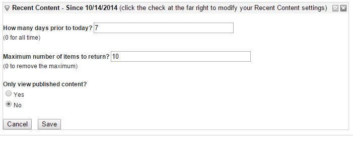
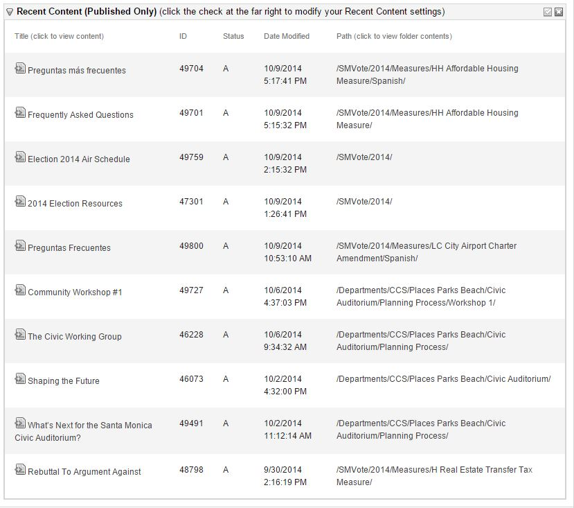

#EktronRecentContent

An Ektron workarea widget to display content recently edited by the current logged in user.

This widget was developed and tested against Ektron 8.6.1.

## Usage

Ektron workarea widgets are displayed on the so-called *Smart Desktop*, which is found under the **Desktop** tab in the Workarea.

See the [Ektron documentation](http://documentation.ektron.com/cms400/v8.61/Reference/Web/EktronReferenceWeb.html#Content/Managing_Content.htm#Using) 
for details of using and configuring the *Smart Desktop*. This usage will assume you have enabled *Smart Desktop Widgets* and have added the `RecentContent` widget
according to Ektron's documentation.

When users first log in and view the *Smart Desktop*, with the `RecentContent` widget added, they will be presented with an empty grid, similar to:

This shows that the user hasn't edited any content within the parameters of the widget.  

To modify the widget settings, click the checkmark at the top right of the widget's title bar. This brings the widget into *Edit* mode, where a user sees inputs for each of the parameters:

The widget defaults to 7 days of history, showing a maximum of 10 items, whether or not those items are currently published. 

  - Users may enter any integer number of days to pull history for, or 0 to to omit the date restriction.  
  - Users may enter any integer for the maximum number of items to return, or 0 to omit the item limit.  
  - Users may select whether or not to list only published content items.

Assuming the user has edited content within the parameters of the widget, they will be presented with a grid of details for each of these content items.

The **title** of any content item can be clicked to take the user directly to that content item in the workarea. Similarly, the **path** can be clicked to take the user directly to that content item's *folder* in the workarea.
The id, status, and last edit date are also shown.

The user can edit their preferences at any time, by clicking the checkmark at the top right of the widget's title bar. The widget will reload according to the current settings.
